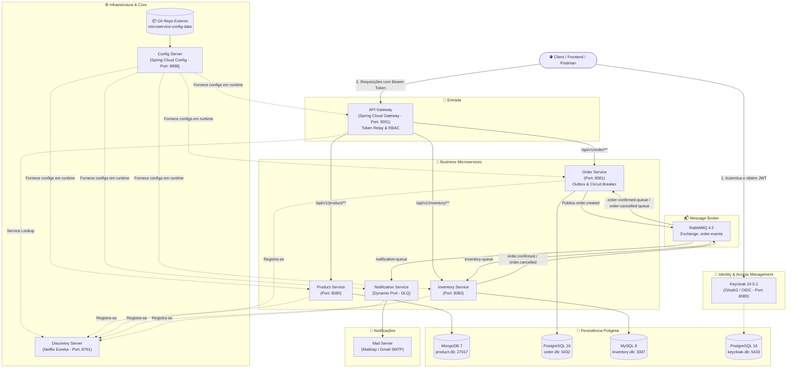
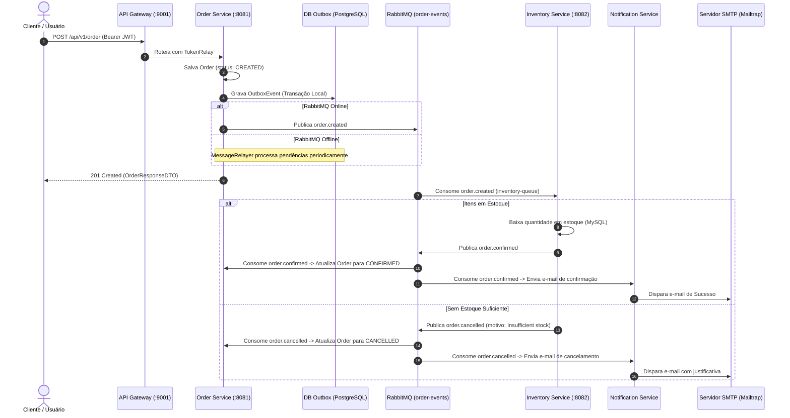

# 🛒 E-Commerce Microservices Platform

[](https://openjdk.org/)
[](https://spring.io/projects/spring-boot)
[](https://spring.io/projects/spring-cloud)
[](https://www.keycloak.org/)
[](https://www.rabbitmq.com/)
[](https://www.docker.com/)
[](https://github.com/luizspolador/ecommerce-ms/blob/main/LICENSE)

Plataforma robusta de comércio eletrônico desenvolvida com arquitetura orientada a microsserviços (**Microservices Architecture**), orientada a eventos (**Event-Driven Architecture - EDA**) e seguindo as melhores práticas de sistemas distribuídos e o **12-Factor App**.

---

## 📌 Sumário
- [Visão Geral da Arquitetura](#-visão-geral-da-arquitetura)
- [Padrões de Arquitetura Implementados](#-padrões-de-arquitetura-implementados)
- [Descrição dos Componentes e Serviços](#-descrição-dos-componentes-e-serviços)
  - [Discovery Server (Eureka)](#1-discovery-server-service-registry)
  - [Config Server & Repositório Centralizado](#2-config-server--repositório-centralizado-config-data)
  - [API Gateway](#3-api-gateway-ponto-de-entrada-único)
  - [Product Service](#4-product-service)
  - [Inventory Service](#5-inventory-service)
  - [Order Service](#6-order-service)
  - [Notification Service](#7-notification-service)
- [Fluxo de Negócio Assíncrono (Saga & Outbox)](#-fluxo-de-negócio-assíncrono-saga--outbox)
- [URLs e Tabela de Endpoints](#-urls-e-tabela-de-endpoints)
- [Segurança & Autenticação (OAuth2 / Keycloak)](#-segurança--autenticação-oauth2--keycloak)
- [Tecnologias e Versões](#-tecnologias-e-versões)
- [Infraestrutura Docker](#-infraestrutura-docker)
- [Como Executar o Projeto](#-como-executar-o-projeto)
- [Autor e Contato](#-autor-e-contato)

---

## 🏛 Visão Geral da Arquitetura

A solução adota persistência poliglota (**Polyglot Persistence**), comunicação reativa e desacoplamento assíncrono via mensageria:



---

## 🧩 Padrões de Arquitetura Implementados

1. **API Gateway Pattern**: Ponto único de entrada para todos os clientes, responsável por roteamento, autenticação, propagação de token JWT (*Token Relay*) e desacoplamento de URLs internas.
2. **Service Discovery & Registry Pattern**: Registro dinâmico de instâncias com Netflix Eureka, viabilizando balanceamento de carga client-side (*Spring Cloud LoadBalancer*) e auto-escalabilidade.
3. **Externalized Configuration Pattern**: Todas as configurações de ambientes (dev, prod) são externalizadas e servidas pelo Spring Cloud Config Server.
4. **Database-per-Service (Polyglot Persistence)**: Cada microsserviço possui e gerencia seu próprio banco de dados isolado (MongoDB, PostgreSQL e MySQL), garantindo baixo acoplamento e independência de esquema.
5. **Transactional Outbox Pattern**: Evita perda de eventos de mensageria caso o broker (RabbitMQ) esteja indisponível no momento da criação do pedido, garantindo entrega *at-least-once*.
6. **Saga Pattern (Choreography-based)**: Orquestração distribuída assíncrona entre pedidos e estoque sem bloqueio síncrono HTTP.
7. **Circuit Breaker & Retry Patterns**: Implementado via Resilience4j para tolerância a falhas e resiliência em chamadas externas.
8. **Dead Letter Queue (DLQ / DLX)**: Tratamento de exceções e quarentena de mensagens não processáveis no serviço de notificações.
9. **Role-Based Access Control (RBAC)**: Autorização granular baseada em roles (`ADMIN`, `USER`) extraídas diretamente do token JWT gerado pelo Keycloak.
10. **Java 21 Virtual Threads (Project Loom)**: Habilitadas em todos os microsserviços (`spring.threads.virtual.enabled: true`) para altíssimo throughput com I/O não bloqueante leve.

---

## 📦 Descrição dos Componentes e Serviços

### 1. Discovery Server (Service Registry)
* **Tecnologia**: Spring Cloud Netflix Eureka Server
* **Porta**: `8761`
* **Descrição**: Atua como o catálogo central do ecossistema. Sempre que um microsserviço sobe, ele se registra dinamicamente no Eureka. O API Gateway e outros serviços consultam o Eureka para resolver nomes de serviços lógicos (ex: `lb://order-service`) para endereços IP e portas reais, permitindo escalar horizontalmente qualquer serviço com instâncias dinâmicas (`server.port=0`).
* **Dashboard Web**: `http://localhost:8761`

---

### 2. Config Server & Repositório Centralizado (`config-data`)
* **Tecnologia**: Spring Cloud Config Server
* **Porta**: `8888`
* **Descrição**: Centraliza todas as propriedades de configuração (`application.yml`) dos microsserviços. Os microsserviços consultam o Config Server no bootstrap (`spring.config.import=optional:configserver:http://localhost:8888`). Possui suporte ao `@RefreshScope` do Spring Boot Actuator para recarregar propriedades em tempo de execução sem reiniciar as aplicações.

> [!IMPORTANT]
> **Repositório Separado para Configurações**:
> A pasta local [`config-data`](config-data) está vinculada e sincronizada com um repositório Git dedicado:
> 🔗 **[microservice-config-data (GitHub)](https://github.com/luizspolador/microservice-config-data.git)**
> 
> O `config-server` lê as configurações diretamente desse repositório Git remoto (na branch `main`), aplicando o princípio de separação entre código-fonte da aplicação e dados de configuração de ambiente.

---

### 3. API Gateway (Ponto de Entrada Único)
* **Tecnologia**: Spring Cloud Gateway (Spring WebFlux reativo) + Spring Security OAuth2 Resource Server & Client
* **Porta**: `9001`
* **Descrição**: Ponto de entrada de todas as requisições externas. 
  * Realiza a validação dos tokens JWT emitidos pelo Keycloak.
  * Mapeia as roles do realm (`realm_access.roles`) para `ROLE_ADMIN` e `ROLE_USER`.
  * Encaminha requisições usando balanceamento de carga (`lb://`).
  * Utiliza o filtro `TokenRelay` para repassar o cabeçalho `Authorization: Bearer <token>` aos microsserviços downstream.

---

### 4. Product Service
* **Tecnologia**: Spring Boot 4.0.8, Spring Data MongoDB, MapStruct, Bean Validation
* **Porta**: `8080` (configurada via Config Server)
* **Banco de Dados**: MongoDB 7.0 (`product-db` na porta `27017`)
* **Descrição**: Responsável pelo catálogo de produtos da loja.
  * Cadastro, listagem, busca por ID, atualização e remoção de produtos.
  * Mapeamento de entidades e DTOs de alta performance com MapStruct.
  * Integração com `@RefreshScope` para mensagens de manutenção dinâmicas (`app.maintenance.message`).

---

### 5. Inventory Service
* **Tecnologia**: Spring Boot 4.0.8, Spring Data JPA, Hibernate, MySQL Driver, Spring AMQP
* **Porta**: `8082` (configurada via Config Server)
* **Banco de Dados**: MySQL 8.0 (`inventory-db` na porta `3307`)
* **Descrição**: Gerencia o estoque de produtos identificados por código SKU.
  * Consulta de disponibilidade de estoque (`isInStock`).
  * Atualização e baixa de estoque (`reduceStock`).
  * **Consumidor de Eventos**: Ouve a fila `inventory-queue` quando um pedido é criado (`order.created`). Se todos os itens estiverem em estoque, decrementa a quantidade e publica `order.confirmed`. Caso falte estoque, cancela o pedido publicando `order.cancelled`.

---

### 6. Order Service
* **Tecnologia**: Spring Boot 4.0.8, Spring Data JPA, PostgreSQL Driver, Spring AMQP, Resilience4j, Spring Security OAuth2
* **Porta**: `8081` (configurada via Config Server)
* **Banco de Dados**: PostgreSQL 16 (`order-db` na porta `5432`)
* **Descrição**: Responsável pelo ciclo de vida das ordens de compra.
  * **Criação de Pedidos**: Recebe o pedido, associa ao `userId` extraído do JWT, define o status inicial como `CREATED` e armazena os itens (`OrderLineItems`).
  * **Transactional Outbox Pattern**: Grava o evento na tabela `outbox_events` na mesma transação relacional. Caso o RabbitMQ esteja indisponível, o agendador [`MessageRelayer`](order-service/src/main/java/br/com/spolador/ecommerce/order_service/scheduler/MessageRelayer.java) faz a re-entrega automática.
  * **Resiliência**: Configurado com Circuit Breaker e Retry do Resilience4j com backoff exponencial.
  * **Atualização de Status**: Ouve as filas `order-confirmed-queue` e `order-cancelled-queue` para atualizar o status para `CONFIRMED` ou `CANCELLED`.

---

### 7. Notification Service
* **Tecnologia**: Spring Boot 4.0.8, Spring AMQP (RabbitMQ), Spring Mail, Spring Retry
* **Porta**: Dinâmica (`server.port=0`)
* **Descrição**: Microsserviço puramente orientado a eventos responsável por notificar o cliente via e-mail.
  * Escuta a fila `notification-queue` (tópicos `order.confirmed` e `order.cancelled`).
  * Dispara e-mails transacionais formatados via SMTP (Mailtrap em desenvolvimento e Gmail em produção).
  * **Resiliência com DLQ**: Configuração de retries automáticos com intervalo incremental. Mensagens com falha são roteadas para a Dead Letter Exchange (`notification-dlx`) e armazenadas na fila `notification-dlq` para auditoria.

---

## 🔄 Fluxo de Negócio Assíncrono (Saga & Outbox)



---

## 🌐 URLs e Tabela de Endpoints

### 1. Acesso Unificado via API Gateway (`http://localhost:9001`)

Todas as requisições dos clientes devem passar pelo API Gateway na porta `9001`:

| Serviço Alvo | Método | Endpoint no Gateway | Requisito de Autenticação / Role | Descrição |
| :--- | :--- | :--- | :--- | :--- |
| **Product** | `GET` | `/api/v1/product` | 🔓 Público (`permitAll`) | Lista todos os produtos cadastrados |
| **Product** | `GET` | `/api/v1/product/{id}` | 🔓 Público (`permitAll`) | Busca produto por identificador |
| **Product** | `POST` | `/api/v1/product` | 🔒 `ROLE_ADMIN` | Cadastra um novo produto |
| **Product** | `PUT` | `/api/v1/product/{id}` | 🔒 `ROLE_ADMIN` | Atualiza dados de um produto |
| **Product** | `DELETE` | `/api/v1/product/{id}` | 🔒 `ROLE_ADMIN` | Remove um produto |
| **Inventory** | `GET` | `/api/v1/inventory` | 🔓 Público (`permitAll`) | Lista todos os registros de estoque |
| **Inventory** | `GET` | `/api/v1/inventory/{sku}?quantity={qty}` | 🔓 Público (`permitAll`) | Verifica se há estoque para o SKU |
| **Inventory** | `POST` | `/api/v1/inventory` | 🔒 `ROLE_ADMIN` | Cria um novo registro de estoque |
| **Inventory** | `PUT` | `/api/v1/inventory/{id}` | 🔒 `ROLE_ADMIN` | Atualiza item de estoque por ID |
| **Inventory** | `PUT` | `/api/v1/inventory/reduce/{sku}?quantity={qty}` | 🔒 `ROLE_ADMIN` | Reduz manualmente a quantidade de estoque |
| **Inventory** | `DELETE` | `/api/v1/inventory/{id}` | 🔒 `ROLE_ADMIN` | Remove um registro de estoque |
| **Order** | `POST` | `/api/v1/order` | 🔒 `ROLE_USER` | Cria um novo pedido de compra |
| **Order** | `GET` | `/api/v1/order` | 🔒 `ROLE_ADMIN` ou `ROLE_USER` | Lista pedidos (Admin: todos; User: apenas os seus) |
| **Order** | `GET` | `/api/v1/order/{id}` | 🔒 `ROLE_ADMIN` ou `ROLE_USER` | Obtém detalhes de um pedido por ID |
| **Order** | `DELETE` | `/api/v1/order/{id}` | 🔒 `ROLE_ADMIN` | Deleta um pedido por ID |

---

### 2. Endpoints Diretos dos Serviços & Infraestrutura (Acesso Interno/Dev)

| Serviço | Porta Padrão | URL Base / Dashboard | Endpoints Especiais |
| :--- | :--- | :--- | :--- |
| **Keycloak IAM** | `8080` | `http://localhost:8080` | Realm: `ecommerce-realm` / Console Admin |
| **Discovery Server** | `8761` | `http://localhost:8761` | Eureka Dashboard & Service Health |
| **Config Server** | `8888` | `http://localhost:8888` | `/{service-name}/{profile}` (Ex: `/product-service/default`) |
| **API Gateway** | `9001` | `http://localhost:9001` | Ponto único de roteamento |
| **Product Service** | `8080` | `http://localhost:8080` | `/actuator/health`, `/actuator/refresh` |
| **Order Service** | `8081` | `http://localhost:8081` | `/actuator/health`, `/actuator/circuitbreakers` |
| **Inventory Service** | `8082` | `http://localhost:8082` | `/actuator/health`, `/actuator/refresh` |
| **Notification Service**| `0` (dinâmica) | Registrado no Eureka | Consumidor AMQP (sem endpoints REST abertos) |
| **RabbitMQ UI** | `15672` | `http://localhost:15672` | Usuário/Senha: `guest` / `guest` |

---

## 🔒 Segurança & Autenticação (OAuth2 / Keycloak)

O sistema utiliza o padrão da indústria para autenticação e autorização centralizadas:

* **Servidor de Identidade**: Keycloak 24.0.1 executando em container com PostgreSQL.
* **Realm**: `ecommerce-realm`
* **Client ID**: `api-gateway-client`
* **Tipo de Token**: JWT (JSON Web Token) contendo claims de usuário e roles no caminho `realm_access.roles`.
* **Conversão Reativa de Permissões**: O Gateway intercepta o JWT, extrai as roles do Keycloak e mapeia para granted authorities do Spring Security com o prefixo `ROLE_` (ex: `ROLE_ADMIN`, `ROLE_USER`).
* **Propagação de Identidade**: No Order Service, o identificador único do cliente (`sub`) é extraído diretamente do token via `@AuthenticationPrincipal Jwt jwt` para associar o pedido ao respectivo usuário de forma segura e auditável.

---

## 🛠 Tecnologias e Versões

| Categoria | Tecnologia | Versão | Função no Ecossistema |
| :--- | :--- | :--- | :--- |
| **Linguagem** | Java (OpenJDK) | **21 (LTS)** | Plataforma base com suporte a **Virtual Threads** |
| **Framework Base** | Spring Boot | **4.0.8** | Base para criação de microsserviços |
| **Cloud Framework**| Spring Cloud | **2025.1.3** | Componentes de sistemas distribuídos |
| **Service Registry**| Spring Cloud Netflix Eureka | **2025.1.3** | Registro e descoberta dinâmica de serviços |
| **API Gateway** | Spring Cloud Gateway (WebFlux)| **2025.1.3** | Roteamento reativo, filtros e token relay |
| **Configuração** | Spring Cloud Config Server | **2025.1.3** | Servidor centralizado de configurações |
| **Segurança / IAM**| Keycloak | **24.0.1** | Provedor de Identidade OAuth2 / OpenID Connect |
| **Mensageria** | RabbitMQ | **4.2-management** | Broker de mensageria assíncrona AMQP |
| **Resiliência** | Resilience4j | **2.3.0** | Circuit Breaker, Retry e Fallbacks |
| **Banco NoSQL** | MongoDB | **7.0.4** | Catálogo de produtos (Product Service) |
| **Banco Relacional**| PostgreSQL | **16-alpine** | Pedidos (Order Service) e Keycloak IAM |
| **Banco Relacional**| MySQL | **8.0** | Controle de Estoque (Inventory Service) |
| **E-mail / SMTP** | Mailtrap / Spring Mail | - | Servidor SMTP para disparo de e-mails transacionais |
| **Mapeamento DTO** | MapStruct | **1.6.3** | Mapeador estático de alta performance |
| **Utilitários** | Lombok | - | Redução de código boilerplate |
| **Containers** | Docker & Docker Compose | - | Orquestração de toda a infraestrutura |

---

## 🐳 Infraestrutura Docker

O arquivo [`docker-compose.yml`](docker-compose.yml) provê todos os serviços de suporte necessários para a execução do ecossistema:

```yaml
services:
  mongodb:          # MongoDB 7.0.4 para Product Service (Porta 27017)
  inventory-db:     # MySQL 8.0 para Inventory Service (Porta 3307:3306)
  order-db:         # PostgreSQL 16 para Order Service (Porta 5432:5432)
  keycloak-db:      # PostgreSQL 16 para o Keycloak (Porta 5433:5432)
  keycloak:         # Keycloak IAM 24.0.1 (Porta 8080:8080)
  rabbitmq:         # RabbitMQ 4.2 Management (Portas 5672 e 15672)
```

---

## 🚀 Como Executar o Projeto

### Pré-requisitos
* **Java 21 JDK** instalado e configurado (`JAVA_HOME`).
* **Maven 3.9+** instalado.
* **Docker** e **Docker Compose** instalados e em execução.
* Acesso à internet para download de dependências e imagens.

---

### Passo 1: Subir os Containers de Infraestrutura
No diretório raiz do projeto, inicie todos os bancos de dados, o RabbitMQ e o Keycloak:
```bash
docker compose up -d
```
> Verifique o status dos containers com `docker compose ps` para garantir que todos estejam saudáveis.

---

### Passo 2: Configurar o Keycloak
1. Acesse o painel do Keycloak: `http://localhost:8080` (Usuário: `admin` / Senha: `admin`).
2. Crie o Realm: `ecommerce-realm`.
3. Crie o Client: `api-gateway-client` (com suporte a Service Accounts / Authorization Code Flow).
4. Crie as Roles do Realm: `ADMIN` e `USER`.
5. Crie os usuários para teste associando as devidas roles.

---

### Passo 3: Ordem de Inicialização dos Microsserviços
Para garantir a correta resolução de configurações e registro de serviços, execute as aplicações na seguinte ordem:

1. **Config Server** (Porta `8888`):
   ```bash
   cd config-server
   mvn spring-boot:run
   ```
   > 💡 Requer as variáveis de ambiente `GITHUB_USER` e `GITHUB_TOKEN` para clonar o repositório [`microservice-config-data`](https://github.com/luizspolador/microservice-config-data.git).

2. **Discovery Server** (Porta `8761`):
   ```bash
   cd discovery-server
   mvn spring-boot:run
   ```
   > Acesse `http://localhost:8761` para visualizar o painel do Eureka.

3. **API Gateway** (Porta `9001`):
   ```bash
   cd api-gateway
   mvn spring-boot:run
   ```

4. **Microsserviços de Negócio** (Podem ser iniciados em qualquer ordem):
   * **Product Service**: `cd product-service && mvn spring-boot:run`
   * **Inventory Service**: `cd inventory-service && mvn spring-boot:run`
   * **Order Service**: `cd order-service && mvn spring-boot:run`
   * **Notification Service**: `cd notification-service && mvn spring-boot:run`

---

## 👨‍💻 Autor

Desenvolvido por **Luiz Henrique Spolador**.

* **LinkedIn**: [luizspolador](https://www.linkedin.com/in/luizspolador/)
* **GitHub Principal**: [luizspolador](https://github.com/luizspolador)
* **Repositório do Projeto**: [ecommerce-ms](https://github.com/luizspolador/ecommerce-ms)
* **Repositório de Configurações**: [microservice-config-data](https://github.com/luizspolador/microservice-config-data)

---
*Gostou do projeto? Deixe uma ⭐️ no repositório!*