# 🛒 E-Commerce Microservices Platform

Plataforma completa de comércio eletrônico baseada em arquitetura de microsserviços orientada a eventos (**Event-Driven Architecture - EDA**), com persistência poliglota, resiliência distribuída, segurança de ponta a ponta via OAuth2/OIDC e **100% de cobertura de testes automatizados**.

---

## 🏛 Arquitetura do Sistema

```mermaid
%%{init: {
  'theme': 'base',
  'themeVariables': {
    'primaryColor': '#1E293B',
    'primaryTextColor': '#FFFFFF',
    'primaryBorderColor': '#3B82F6',
    'lineColor': '#2563EB',
    'textColor': '#000000',
    'edgeLabelBackground': '#FFFFFF',
    'clusterBkg': 'transparent',
    'clusterBorder': '#64748B',
    'fontSize': '15px',
    'fontFamily': 'ui-sans-serif, system-ui, -apple-system, Segoe UI, Roboto, Helvetica, Arial, sans-serif'
  },
  'themeCSS': '.edgeLabel { color: #000000 !important; font-weight: bold; } .edgeLabel span { color: #000000 !important; } .label-container { fill: #FFFFFF !important; }'
}}%%
flowchart TD
    %% ==========================================
    %% CAMADA DE ACESSO, SEGURANÇA E GOVERNANÇA
    %% ==========================================
    Client["🌐 <big><b>Clientes & Aplicações</b></big><br/>• Web / Mobile / Postman<br/>• Requisições REST com Bearer JWT"]

    subgraph SecurityControl ["🔐 Identidade & Acesso (OAuth2 / OIDC)"]
        Keycloak["<big><b>Keycloak 24.0.1</b></big> (Port: 8080)<br/>• Realm: 'ecommerce-realm'<br/>• Emissor Central de JWT (RS256)<br/>• Roles: ROLE_ADMIN, ROLE_USER"]
        PostgresKC[("<b>PostgreSQL 16</b><br/>keycloak-db: 5433<br/>Tabelas IAM & Sessions")]
    end

    subgraph PlatformControl ["⚙️ Governança de Plataforma"]
        Eureka["<big><b>Netflix Eureka</b></big> (Port: 8761)<br/>• Service Discovery & Registry<br/>• Dynamic Instances & Heartbeat"]
        ConfigServer["<big><b>Spring Cloud Config</b></big> (Port: 8888)<br/>• Repositório Git Centralizado<br/>• Suporte a @RefreshScope em runtime"]
    end

    subgraph GatewayLayer ["🚪 API Gateway (Ponto Central de Entrada)"]
        Gateway["<big><b>Spring Cloud Gateway</b></big> (Port: 9001 - WebFlux Reativo)<br/>• Token Relay Filter (Encaminhamento de Bearer JWT aos serviços)<br/>• Roteamento Dinâmico com Spring Cloud LoadBalancer (lb://)<br/>• Validação de Escopos OAuth2, RBAC & Segurança Perimetral"]
    end

    %% ==========================================
    %% MICROSSERVIÇOS DE NEGÓCIO E PERSISTÊNCIA
    %% ==========================================
    subgraph ProductDomain ["📦 Domínio: Catálogo de Produtos"]
        ProductService["<big><b>Product Service</b></big> (Port: 8080)<br/>• Java 21 LTS + Virtual Threads (Loom)<br/>• CRUD Catálogo & Documentação Swagger<br/>• Endpoints: POST /api/v1/product | GET /api/v1/product<br/>• Emissor de 'ProductCreatedEvent'"]
        MongoDB[("<b>MongoDB 7.0</b><br/>product-db: 27017<br/>Collection: 'products'")]
    end

    subgraph InventoryDomain ["📊 Domínio: Estoque & Validação"]
        InventoryService["<big><b>Inventory Service</b></big> (Port: 8082)<br/>• Java 21 LTS + Virtual Threads (Loom)<br/>• Projeção Local: t_registered_product (Sync via EDA)<br/>• Validação Obrigatória: Rejeita SKU inexistente (HTTP 400)<br/>• Baixa Atômica com Lock Pessimista (SELECT ... FOR UPDATE)<br/>• Consumidor Idempotente (Tabela t_processed_order)<br/>• Endpoints: POST /api/v1/inventory | GET /api/v1/inventory/{sku}"]
        MySQLInv[("<b>MySQL 8.0</b><br/>inventory-db: 3307<br/>• t_inventory (Saldos em Estoque)<br/>• t_registered_product (Projeção CQRS)<br/>• t_processed_order (Idempotência)")]
    end

    subgraph OrderDomain ["🛒 Domínio: Pedidos & Orquestração"]
        OrderService["<big><b>Order Service</b></big> (Port: 8081)<br/>• Java 21 LTS + Virtual Threads (Loom)<br/>• Ciclo de Vida: CREATED ➔ CONFIRMED / CANCELLED<br/>• Transactional Outbox (t_outbox) + MessageRelayer<br/>• Resilience4j (Circuit Breaker & Retry com Backoff)<br/>• Proteção contra IDOR / BOLA (Validação de Ownership)<br/>• Endpoints: POST /api/v1/order | GET /api/v1/order/{id}"]
        PostgresOrder[("<b>PostgreSQL 16</b><br/>order-db: 5432<br/>• t_orders / t_order_items<br/>• t_outbox (Outbox Pattern)")]
    end

    %% ==========================================
    %% MENSAGERIA ASSÍNCRONA E RESILIÊNCIA (EDA)
    %% ==========================================
    subgraph BrokerLayer ["📬 Mensageria Assíncrona (RabbitMQ 4.2 - AMQP :5672 / Web :15672)"]
        ExProduct["<b>TopicExchange: 'product-events'</b>"]
        ExOrder["<b>TopicExchange: 'order-events'</b>"]

        QProduct["<b>Queue: 'inventory-product-queue'</b><br/>Routing: product.created"]
        QInv["<b>Queue: 'inventory-queue'</b><br/>Routing: order.created (DLX: inventory-dlx)"]
        QConfirmed["<b>Queue: 'order-confirmed-queue'</b><br/>Routing: order.confirmed (DLX: order-dlx)"]
        QCancelled["<b>Queue: 'order-cancelled-queue'</b><br/>Routing: order.cancelled (DLX: order-dlx)"]
        QNotify["<b>Queue: 'notification-queue'</b><br/>Routing: order.* (DLX: notification-dlx)"]

        DLQ["<b>Dead Letter Queues (DLQ)</b><br/>• order-dlq | inventory-dlq | notification-dlq<br/>• Retenção e auditoria após esgotamento de retries"]
    end

    %% ==========================================
    %% NOTIFICAÇÕES E OBSERVABILIDADE
    %% ==========================================
    subgraph NotificationDomain ["📧 Notificações Transacionais"]
        NotificationService["<big><b>Notification Service</b></big> (Porta Dinâmica)<br/>• Java 21 LTS + Virtual Threads (Loom)<br/>• Consumidor AMQP com Retry Exponencial (3x)<br/>• Envio de e-mails transacionais (HTML/Text)"]
        MailServer["<b>Servidor SMTP</b><br/>• Mailtrap Sandbox :2525 (Dev)<br/>• Gmail SMTP TLS (Prod)"]
    end

    subgraph ObservabilityStack ["🔭 Observabilidade & Telemetria Unificada"]
        GrafanaLGTM["<big><b>Grafana LGTM Stack & OpenTelemetry</b></big><br/>• Grafana UI (Port: 3000) | OTLP HTTP (Port: 4318) / gRPC (Port: 4317)<br/>• Distributed Tracing (TraceId/SpanId W3C/B3), Logs & Métricas Actuator/Prometheus"]
    end

    %% ==========================================
    %% CONEXÕES E FLUXOS DO SISTEMA
    %% ==========================================
    Client -->|"<b><font color='#000000'>1. Autentica com credenciais (POST /token)</font></b>"| Keycloak
    Keycloak -.-> PostgresKC
    Client -->|"<b><font color='#000000'>2. Requisição REST com Header 'Authorization: Bearer JWT'</font></b>"| Gateway

    Gateway -.->|"<b><font color='#000000'>Resolução de rotas via Service Discovery</font></b>"| Eureka
    ConfigServer -.->|"<b><font color='#000000'>Propriedades centralizadas aos serviços (@RefreshScope)</font></b>"| Gateway

    Gateway -->|"<b><font color='#000000'>Route: /api/v1/product/**</font></b>"| ProductService
    Gateway -->|"<b><font color='#000000'>Route: /api/v1/inventory/**</font></b>"| InventoryService
    Gateway -->|"<b><font color='#000000'>Route: /api/v1/order/**</font></b>"| OrderService

    ProductService --> MongoDB
    InventoryService --> MySQLInv
    OrderService --> PostgresOrder

    ProductService -->|"<b><font color='#000000'>1. Publica 'product.created'</font></b>"| ExProduct
    ExProduct -->|"<b><font color='#000000'>Routing key: product.created</font></b>"| QProduct
    QProduct -->|"<b><font color='#000000'>2. Atualiza projeção local em t_registered_product</font></b>"| InventoryService

    OrderService -->|"<b><font color='#000000'>1. Transactional Outbox publica 'order.created'</font></b>"| ExOrder
    ExOrder -->|"<b><font color='#000000'>Routing key: order.created</font></b>"| QInv
    QInv -->|"<b><font color='#000000'>2. Valida idempotência, lock pessimista e debita estoque</font></b>"| InventoryService

    InventoryService -->|"<b><font color='#000000'>3. Publica resultado da validação</font></b>"| ExOrder
    ExOrder -->|"<b><font color='#000000'>Routing key: order.confirmed</font></b>"| QConfirmed
    ExOrder -->|"<b><font color='#000000'>Routing key: order.cancelled</font></b>"| QCancelled
    ExOrder -->|"<b><font color='#000000'>Routing key: order.*</font></b>"| QNotify

    QConfirmed -->|"<b><font color='#000000'>4a. Atualiza pedido para CONFIRMED</font></b>"| OrderService
    QCancelled -->|"<b><font color='#000000'>4b. Atualiza pedido para CANCELLED</font></b>"| OrderService

    QNotify -->|"<b><font color='#000000'>Consome evento final de pedido</font></b>"| NotificationService
    NotificationService -->|"<b><font color='#000000'>Envia e-mail de confirmação ou cancelamento</font></b>"| MailServer

    ProductService -.->|"<b><font color='#000000'>Traces & Logs OTLP</font></b>"| GrafanaLGTM
    OrderService -.->|"<b><font color='#000000'>Traces & Logs OTLP</font></b>"| GrafanaLGTM
    InventoryService -.->|"<b><font color='#000000'>Traces & Logs OTLP</font></b>"| GrafanaLGTM
    NotificationService -.->|"<b><font color='#000000'>Traces & Logs OTLP</font></b>"| GrafanaLGTM
    BrokerLayer -.->|"<b><font color='#000000'>Mensagens rejeitadas após 3 tentativas</font></b>"| DLQ

    %% ==========================================
    %% SUBGRAFOS: FUNDO TRANSPARENTE E BORDAS COLORIDAS (ADEUS FUNDO CINZA)
    %% ==========================================
    style SecurityControl fill:transparent,stroke:#9333EA,stroke-width:2px,stroke-dasharray: 4 4
    style PlatformControl fill:transparent,stroke:#64748B,stroke-width:2px,stroke-dasharray: 4 4
    style GatewayLayer fill:transparent,stroke:#0284C7,stroke-width:2px,stroke-dasharray: 4 4
    style ProductDomain fill:transparent,stroke:#2563EB,stroke-width:2px,stroke-dasharray: 4 4
    style InventoryDomain fill:transparent,stroke:#059669,stroke-width:2px,stroke-dasharray: 4 4
    style OrderDomain fill:transparent,stroke:#D97706,stroke-width:2px,stroke-dasharray: 4 4
    style BrokerLayer fill:transparent,stroke:#EA580C,stroke-width:2px,stroke-dasharray: 4 4
    style NotificationDomain fill:transparent,stroke:#9333EA,stroke-width:2px,stroke-dasharray: 4 4
    style ObservabilityStack fill:transparent,stroke:#0D9488,stroke-width:2px,stroke-dasharray: 4 4

    %% ==========================================
    %% CARDS COLORIDOS E VIBRANTES (ADEUS QUADRADOS BRANCOS)
    %% ==========================================
    classDef clientNode fill:#1E40AF,stroke:#93C5FD,stroke-width:2px,color:#FFFFFF;
    classDef secNode fill:#6B21A8,stroke:#D8B4FE,stroke-width:2px,color:#FFFFFF;
    classDef infraNode fill:#334155,stroke:#CBD5E1,stroke-width:2px,color:#FFFFFF;
    classDef gwNode fill:#0369A1,stroke:#7DD3FC,stroke-width:2px,color:#FFFFFF;
    classDef prodNode fill:#1D4ED8,stroke:#93C5FD,stroke-width:2px,color:#FFFFFF;
    classDef invNode fill:#047857,stroke:#6EE7B7,stroke-width:2px,color:#FFFFFF;
    classDef orderNode fill:#B45309,stroke:#FDE68A,stroke-width:2px,color:#FFFFFF;
    classDef dbMongo fill:#15803D,stroke:#86EFAC,stroke-width:2px,color:#FFFFFF;
    classDef dbMySQL fill:#0E7490,stroke:#67E8F9,stroke-width:2px,color:#FFFFFF;
    classDef dbPostgres fill:#3730A3,stroke:#C7D2FE,stroke-width:2px,color:#FFFFFF;
    classDef exchNode fill:#C2410C,stroke:#FED7AA,stroke-width:2px,color:#FFFFFF;
    classDef queueNode fill:#9A3412,stroke:#FDBA74,stroke-width:2px,color:#FFFFFF;
    classDef dlqNode fill:#991B1B,stroke:#FECACA,stroke-width:2px,color:#FFFFFF;
    classDef notifNode fill:#7E22CE,stroke:#E9D5FF,stroke-width:2px,color:#FFFFFF;
    classDef mailNode fill:#0F766E,stroke:#99F6E4,stroke-width:2px,color:#FFFFFF;
    classDef obsNode fill:#0F172A,stroke:#38BDF8,stroke-width:2px,color:#F8FAFC;

    class Client clientNode;
    class Keycloak secNode;
    class PostgresKC dbPostgres;
    class Eureka,ConfigServer infraNode;
    class Gateway gwNode;
    class ProductService prodNode;
    class InventoryService invNode;
    class OrderService orderNode;
    class MongoDB dbMongo;
    class MySQLInv dbMySQL;
    class PostgresOrder dbPostgres;
    class ExProduct,ExOrder exchNode;
    class QProduct,QInv,QConfirmed,QCancelled,QNotify queueNode;
    class DLQ dlqNode;
    class NotificationService notifNode;
    class MailServer mailNode;
    class GrafanaLGTM obsNode;

    %% ==========================================
    %% SETAS EM DESTAQUE (GROSSAS, VIVAS E NÍTIDAS)
    %% ==========================================
    linkStyle default stroke:#2563EB,stroke-width:3px;
```



---

## 🛠 Tecnologias Utilizadas

| Categoria | Tecnologia | Versão | Aplicação / Finalidade |
| :--- | :--- | :--- | :--- |
| **Linguagem** | Java (OpenJDK) | **21 (LTS)** | Plataforma principal com suporte a **Virtual Threads (Project Loom)** |
| **Framework Base** | Spring Boot | **4.0.8** | Estrutura de injeção de dependências, REST APIs e ciclo de vida |
| **Service Discovery** | Spring Cloud Netflix Eureka | **2025.1.3** | Registro dinâmico e resolução de nomes das instâncias com load balancing |
| **API Gateway** | Spring Cloud Gateway (WebFlux) | **2025.1.3** | Roteamento reativo, validação de tokens JWT e *Token Relay* |
| **Configuração Central** | Spring Cloud Config Server | **2025.1.3** | Gestão externalizada de propriedades e perfis com suporte a `@RefreshScope` |
| **Identity & IAM** | Keycloak | **24.0.1** | Provedor de identidade OAuth2 / OpenID Connect com RBAC |
| **Mensageria** | RabbitMQ | **4.2-management** | Broker AMQP para orquestração de eventos assíncronos, DLQ e sincronização |
| **Banco NoSQL** | MongoDB | **7.0** | Armazenamento de catálogo de produtos com esquema flexível |
| **Banco Relacional** | PostgreSQL | **16-alpine** | Persistência de pedidos, eventos outbox e dados do Keycloak |
| **Banco Relacional** | MySQL | **8.0** | Persistência de estoque, projeção de catálogo e pedidos processados |
| **Resiliência** | Resilience4j | **2.3.0** | Circuit Breaker, Retry com backoff exponencial e Fallbacks |
| **Documentação API** | SpringDoc OpenAPI 3 / Swagger UI | **2.8.5** | Especificação e interface interativa dos endpoints REST |
| **Observabilidade** | OpenTelemetry & Spring Boot Actuator | - | Rastreamento distribuído, métricas e endpoints de saúde |
| **Mapeamento & Utilitários**| MapStruct & Lombok | - | Mapeamento DTO de alta performance e redução de boilerplate |
| **Containers** | Docker & Docker Compose | - | Orquestração unificada de toda a infraestrutura local |
| **Testes Automatizados** | JUnit 5, Mockito & JaCoCo | - | Testes unitários e de integração com **100% de cobertura** |

---

## 📦 Serviços da Aplicação

### 1. Discovery Server (`discovery-server`)
* **Porta**: `8761`
* **Função**: Catálogo e registro de serviços dinâmico baseado no Netflix Eureka. Permite escalabilidade horizontal com portas dinâmicas (`server.port=0`) e balanceamento de carga automático via *Spring Cloud LoadBalancer*.

### 2. Config Server (`config-server`)
* **Porta**: `8888`
* **Função**: Servidor centralizado de configurações externas. Fornece propriedades para os microsserviços via perfis (`dev`, `prod`) e suporta atualização em tempo de execução via `@RefreshScope` sem necessidade de reinício dos serviços.

### 3. API Gateway (`api-gateway`)
* **Porta**: `9001`
* **Função**: Ponto de entrada unificado para clientes. Atua como OAuth2 Resource Server validando tokens JWT emitidos pelo Keycloak, converte roles (`ADMIN`, `USER`), aplica segurança perimetral e repassa as credenciais via *Token Relay* aos serviços internos.

### 4. Product Service (`product-service`)
* **Porta**: `8080` | **Banco**: MongoDB (`product-db:27017`)
* **Função**: Gerencia o catálogo de produtos da plataforma (criação, consulta, atualização e remoção).
  * **Sincronização EDA**: Ao criar um produto, publica o evento `ProductCreatedEvent` na exchange `product-events` (`routing key: product.created`) para atualização imediata dos estoques.
  * Possui endpoints de leitura públicos e operações de escrita restritas a administradores (`ROLE_ADMIN`).

### 5. Inventory Service (`inventory-service`)
* **Porta**: `8082` | **Banco**: MySQL (`inventory-db:3307`)
* **Função**: Gerencia o estoque de produtos por código SKU.
  * **Projeção Local de Produtos**: Consome eventos de produtos criados e mantém a tabela `t_registered_product`.
  * **Validação de Catálogo**: Só permite cadastro ou alteração de estoque para produtos devidamente registrados no catálogo, rejeitando SKUs inexistentes com `ProductNotRegisteredException` (HTTP 400).
  * **Baixa de Estoque Atômica com Lock Pessimista**: `@Lock(LockModeType.PESSIMISTIC_WRITE)` (`SELECT ... FOR UPDATE`) com ordenação alfabética de SKUs para prevenção de deadlocks.
  * **Consumidor Idempotente**: Controle via tabela `ProcessedOrder`, evitando duplicação de baixas por reprocessamento de mensagens.
  * **Endpoints de Baixa Direta**: Suporta operações manuais/administrativas de ajuste de estoque via `PUT /api/v1/inventory/reduce/{sku}`.

### 6. Order Service (`order-service`)
* **Porta**: `8081` | **Banco**: PostgreSQL (`order-db:5432`)
* **Função**: Responsável pelo ciclo de vida das ordens de compra.
  * **Transactional Outbox**: Persiste pedido e evento na mesma transação atômica relacional, garantindo entrega confiável de mensagens mesmo em falhas do broker.
  * **Scheduler de Reenvio**: Processa eventos outbox pendentes em caso de indisponibilidade temporária do RabbitMQ.
  * **Proteção contra BOLA/IDOR**: Valida que clientes comuns só acessem seus próprios pedidos (`jwt.getSubject()`), mantendo visão global apenas para `ROLE_ADMIN`.
  * **Tolerância a Falhas**: Circuit Breaker e Retry com Resilience4j.

### 7. Notification Service (`notification-service`)
* **Porta**: Dinâmica | **Tipo**: Orientado puramente a eventos (AMQP)
* **Função**: Escuta eventos de status de pedidos no RabbitMQ (`order.confirmed` e `order.cancelled`) e envia e-mails transacionais formatados aos clientes via SMTP (Mailtrap em desenvolvimento / Gmail em produção). Possui Dead Letter Queue (`notification-dlq`) para retenção de mensagens com falha.

---

## 🔄 Fluxos de Negócio Assíncronos

### Fluxo 1: Sincronização de Catálogo (EDA - Event-Carried State Transfer)
1. Um administrador cadastra um novo produto via `POST /api/v1/product`.
2. O **Product Service** grava no MongoDB e publica o evento `ProductCreatedEvent` no RabbitMQ (`product.created`).
3. O **Inventory Service** consome a mensagem na fila `inventory-product-queue` e salva/atualiza a projeção na tabela `t_registered_product`.
4. Ao cadastrar estoque (`POST /api/v1/inventory`), o sistema valida se o SKU existe na projeção local, garantindo consistência eventual desacoplada e de alta performance.

```
POST /api/v1/product ──► [Product Service] ──► MongoDB (product-db)
                               │
                      Publica 'product.created'
                               │
                               ▼
                        [RabbitMQ Broker]
                               │
                    Queue: inventory-product-queue
                               │
                               ▼
                     [Inventory Service] ──► MySQL (t_registered_product)
```

---

### Fluxo 2: Pedidos, Orquestração e Compensação (Saga Coreografada & Outbox)
1. O cliente autenticado cria um pedido via `POST /api/v1/order` no Gateway.
2. O **Order Service** persiste o pedido como `CREATED` e salva o evento de domínio na tabela outbox na mesma transação atômica no PostgreSQL.
3. O evento `order.created` é publicado no RabbitMQ.
4. O **Inventory Service** consome a mensagem, valida a idempotência (`ProcessedOrder`) e executa o lock pessimista dos itens.
   * **Se houver estoque suficiente:** debita o saldo, registra o pedido como processado e publica `order.confirmed`.
   * **Se faltar estoque para qualquer item:** executa rollback transacional total e publica `order.cancelled`.
5. O **Order Service** consome a resposta e atualiza o pedido para `CONFIRMED` ou `CANCELLED`.
6. O **Notification Service** consome o evento final e dispara o e-mail transacional correspondente para o cliente.

---

## 🔒 Segurança e Controle de Acesso (RBAC)

* **Servidor de Identidade**: Keycloak 24.0.1 em container dedicado com PostgreSQL.
* **Autenticação**: OAuth2 / OpenID Connect com tokens JWT assinados digitalmente.
* **Defesa em Profundidade**: O Gateway aplica segurança perimetral e repassa as credenciais (*Token Relay*). Cada microsserviço atua de forma independente como OAuth2 Resource Server.
* **Mapeamento de Roles**: O `JwtAuthenticationConverter` extrai as roles de `realm_access.roles` do Keycloak e as injeta no contexto de segurança como `ROLE_ADMIN` e `ROLE_USER`.

---

## 📚 Documentação das APIs (Swagger UI)

Cada microsserviço disponibiliza sua interface interativa Swagger para consulta e testes:

* **Product Service**: `http://localhost:8080/swagger-ui.html`
* **Order Service**: `http://localhost:8081/swagger-ui.html`
* **Inventory Service**: `http://localhost:8082/swagger-ui.html`
* **OpenAPI Specs (JSON)**:
  * Product Service: `http://localhost:8080/v3/api-docs`
  * Order Service: `http://localhost:8081/v3/api-docs`
  * Inventory Service: `http://localhost:8082/v3/api-docs`

---

## 🚀 Como Executar o Projeto

### Pré-requisitos
* **Java 21 JDK** instalado e configurado.
* **Maven 3.9+** instalado.
* **Docker & Docker Compose** em execução.

---

### Passo 1: Iniciar os Containers de Infraestrutura
Na raiz do projeto, inicie os bancos de dados, RabbitMQ e Keycloak:
```bash
docker compose up -d
```

---

### Passo 2: Ordem de Inicialização dos Microsserviços
Execute os serviços na seguinte sequência para garantir a resolução correta de configurações e descoberta:

```bash
# 1. Discovery Server (Porta 8761 - Eureka)
cd discovery-server && mvn spring-boot:run

# 2. Config Server (Porta 8888)
cd config-server && mvn spring-boot:run

# 3. API Gateway (Porta 9001)
cd api-gateway && mvn spring-boot:run

# 4. Microsserviços de Negócio (em terminais separados ou via Run Dashboard do IntelliJ)
cd product-service && mvn spring-boot:run
cd inventory-service && mvn spring-boot:run
cd order-service && mvn spring-boot:run
cd notification-service && mvn spring-boot:run
```

---

## 🧪 Qualidade e Testes Automatizados

O ecossistema conta com uma suíte abrangente de testes unitários e de integração utilizando **JUnit 5**, **Mockito**, **Spring Security Test** e **JaCoCo**:

* **Cobertura de Código**: **100%** de cobertura aferida via JaCoCo em todas as camadas de negócio, controllers, listeners e repositórios.
* **Total de Testes**: **285+ testes automatizados** com **0 falhas**.
* Para rodar os testes e gerar relatórios de cobertura:
```bash
mvn clean test jacoco:report
```
Os relatórios detalhados são gerados em `target/site/jacoco/index.html` em cada projeto.